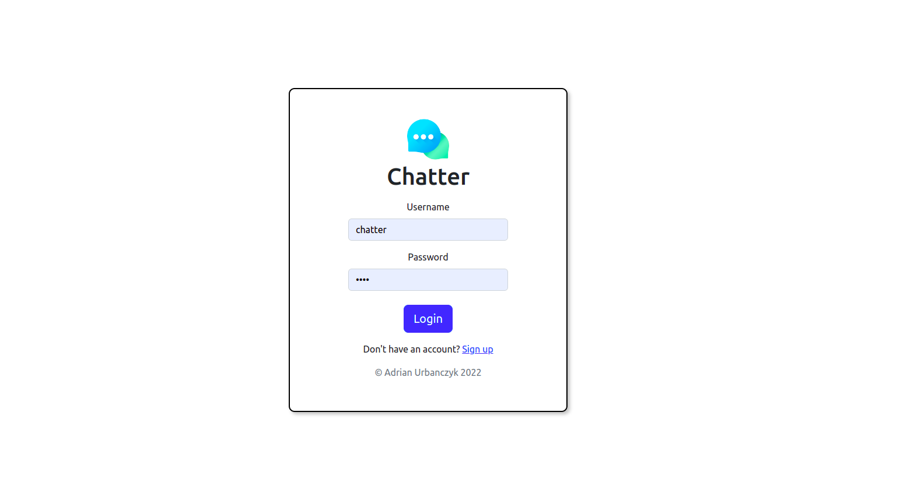
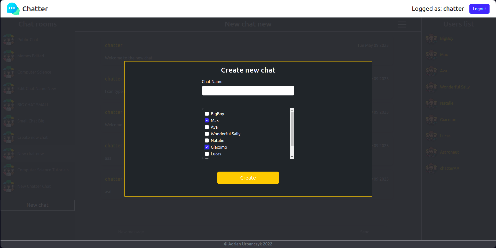

# Chatter

Chatter is an instant messaging social media platform where users can send messages to group
chats. Group chats can be created by anyone but edited only by the admin of the group chat, an
admin is the person who created it. Once created the chat name can be edited, users can be removed
from the group chat and new users can be added.

The frontend of the application is in React, and back-end API in Node.js in an Express framework
with a MongoDB database. Socket.io library is used to manage sockets events
and event groups.

The backend is built with MVC standard. The
authentication is done with JSON Web Tokens. When the user logs in, the API sets HTTP Only
Cookie in the client's browser with a token which later is sent with every single request to the API
from the client.

## **Login**

## **Dashboard**

## **Chat Options**

## **New Chat**

## **Add User To The Chat**

# Assets
* Public Chat Icon - Created by Flaticon.com
* Logo Icon - Created by Flaticon.com
* 404 Icon - Created by Flaticon.com